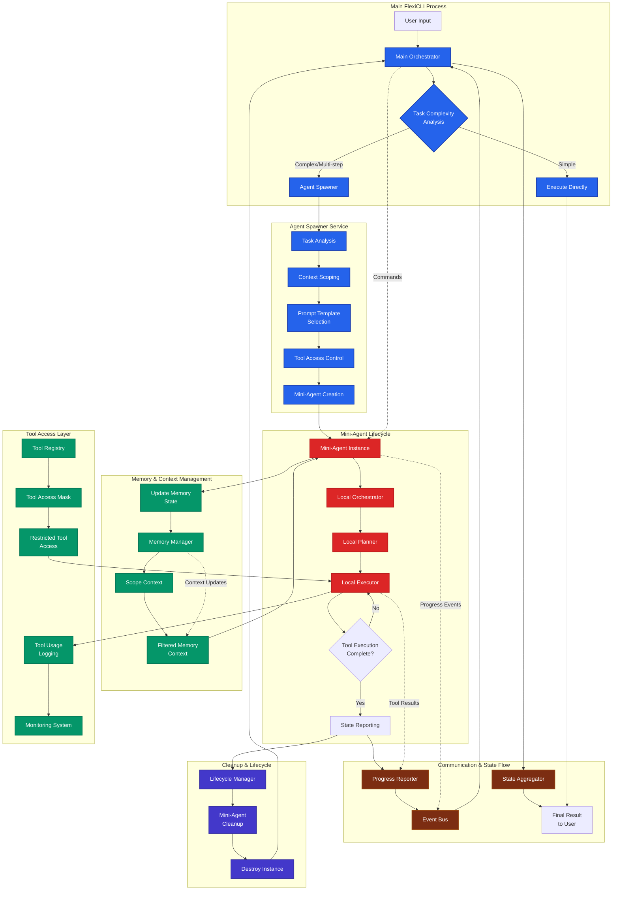

# Mini-Agent Architecture Design

## 🎯 **Overview**

Mini-Agents are ephemeral, specialized sub-orchestrators that inherit FlexiCLI's capabilities but operate with:
- **Scoped context** (focused memory subset)
- **Specialized prompts** (task-specific instructions)
- **Restricted tool access** (only relevant tools)
- **Parent reporting** (all state flows back to main agent)

## 🔄 **Integration Flow Architecture**



## 🏗️ **Technical Stack & Components**

### **New Components Required**

```typescript
src/core/mini-agent/
├── mini-orchestrator.ts     // Lightweight orchestrator for focused tasks
├── agent-spawner.ts         // Factory for creating mini-agents
├── context-scoper.ts        // Memory context filtering
├── progress-reporter.ts     // Event-driven status reporting
├── lifecycle-manager.ts     // Agent cleanup and resource management
└── types.ts                 // Mini-agent interfaces and types
```

### **Enhanced Existing Components**

```typescript
src/core/
├── orchestrator.ts          // Enhanced with mini-agent spawning
├── planner.ts              // Task complexity analysis
└── executor.ts             // Mini-agent execution support

src/memory/
├── memory-manager.ts        // Context scoping capabilities
└── context-scoper.ts        // New: Memory filtering for mini-agents

src/tools/
├── registry.ts             // Tool access restrictions
└── permission-mask.ts      // New: Tool permission system
```

## 🎯 **Research-Based Architecture Decisions**

### **1. Supervisor-Agent Pattern** (Claude Code & AWS Bedrock)
- Main Orchestrator acts as **Supervisor Agent**
- Mini-Agents are **Specialized Worker Agents**
- Clear hierarchical control structure

### **2. Context Isolation Strategy** (Claude Code's approach)
- Each Mini-Agent gets **separate context window**
- **Scoped memory injection** - only relevant context
- **Domain-specific prompts** for specialization

### **3. Event-Driven Communication** (2025 Best Practice)
- **Message passing** between supervisor and workers
- **State aggregation** flows back to supervisor
- **Progress events** for real-time tracking

### **4. Fault-Tolerant Design**
- **Health checks** for mini-agent lifecycle
- **Retry strategies** for failed delegations
- **Graceful degradation** if mini-agent fails

## 📡 **State & Message Exchange Patterns**

### **Core Interfaces**

```typescript
// Task delegation from supervisor to mini-agent
interface MiniAgentTask {
  id: string;
  type: 'search' | 'migration' | 'analysis' | 'refactor' | 'test';
  prompt: string;
  context: ScopedMemoryContext;
  tools: ToolPermissions;
  maxIterations?: number;
  timeoutMs?: number;
  priority?: 'low' | 'normal' | 'high';
}

// Progress reporting from mini-agent to supervisor
interface MiniAgentProgress {
  agentId: string;
  parentId: string;
  status: 'spawning' | 'running' | 'completed' | 'failed' | 'timeout';
  currentTool?: string;
  toolsUsed: ToolUsageLog[];
  output?: string;
  error?: string;
  metadata: {
    tokensUsed: number;
    executionTime: number;
    iterationCount: number;
    memorySize: number;
  };
}

// Context scoping for memory isolation
interface ScopedMemoryContext {
  relevantFiles: string[];
  searchPatterns: string[];
  domainKnowledge: string[];
  excludedContext: string[];
  maxTokens: number;
}

// Tool permission system
interface ToolPermissions {
  allowed: string[];
  restricted: string[];
  readOnly: boolean;
  networkAccess: boolean;
  fileSystemAccess: 'read' | 'write' | 'none';
}
```

### **Event-Driven State Flow**
- **Spawn Event**: Main Orchestrator → Agent Spawner
- **Progress Events**: Mini-Agent → Event Bus → Main Orchestrator
- **Completion Event**: Mini-Agent → State Aggregator → Final Result
- **Error Events**: Any component → Recovery Strategy → Retry/Fallback

### **Memory Context Scoping**
- **Input**: Full memory context from Main Agent
- **Filter**: Domain-specific context extraction
- **Scope**: Task-relevant memory subset
- **Isolation**: Separate context window per mini-agent
- **Aggregation**: Results merged back to main memory

## 🚀 **Production-Ready Features**

### **Parallel Execution** (Claude Code Pattern)
- **Batch Processing**: Execute up to 10 mini-agents in parallel
- **Queue Management**: Additional tasks wait in queue
- **Resource Throttling**: Prevent context/token exhaustion

### **Health & Monitoring**
- **Agent Health Checks**: Continuous monitoring of mini-agent status
- **Execution Metrics**: Token usage, time, iteration counts
- **Audit Trail**: Complete parent-child execution logging

### **Security & Governance**
- **Tool Permission Masks**: Restrict dangerous operations per agent type
- **Context Sandboxing**: Prevent cross-agent data leakage
- **Resource Limits**: Token/time budgets per mini-agent

## 📋 **Implementation Plan**

### **Phase 1: Core Infrastructure**
1. **MiniOrchestrator class** - Lightweight version of main Orchestrator
2. **AgentSpawner service** - Factory for creating mini-agents with specific configs
3. **ContextScoper** - Filters memory context for focused tasks

### **Phase 2: Integration Layer**
4. **Enhanced Orchestrator** - Add mini-agent spawning capabilities
5. **MemoryManager scoping** - Context filtering methods
6. **Tool access control** - Permission masks in ToolRegistry

### **Phase 3: Monitoring & UI**
7. **Parent-child tracking** - Execution tree visualization
8. **Progress reporting** - Real-time mini-agent status updates
9. **State aggregation** - Collect all mini-agent results

## 💡 **Usage Patterns**

### **Example 1: Code Migration Task**
```typescript
const migrationAgent = await orchestrator.spawnMiniAgent({
  id: 'migration-001',
  type: 'migration',
  prompt: `You are a specialized code migration agent. Your task is to migrate
           normalization service from sourceId to targetId pattern. Focus only on
           this specific migration and report all changes back to the main agent.`,
  context: {
    relevantFiles: ['packages/shared/**/*.ts', 'src/services/norm*'],
    searchPatterns: ['sourceId', 'targetId', 'normalization'],
    domainKnowledge: ['migration-patterns', 'service-architecture'],
    excludedContext: ['test-files', 'documentation'],
    maxTokens: 8000
  },
  tools: {
    allowed: ['search', 'read', 'write', 'grep'],
    restricted: ['git', 'bash', 'network'],
    readOnly: false,
    networkAccess: false,
    fileSystemAccess: 'write'
  },
  maxIterations: 20,
  timeoutMs: 300000,
  priority: 'high'
});
```

### **Example 2: Parallel Analysis Tasks**
```typescript
// Spawn multiple specialized agents in parallel
const analysisResults = await Promise.all([
  orchestrator.spawnMiniAgent({
    type: 'analysis',
    prompt: 'Analyze security vulnerabilities in authentication system',
    context: { relevantFiles: ['src/auth/**'], maxTokens: 6000 }
  }),
  orchestrator.spawnMiniAgent({
    type: 'analysis',
    prompt: 'Analyze performance bottlenecks in data processing',
    context: { relevantFiles: ['src/data/**'], maxTokens: 6000 }
  }),
  orchestrator.spawnMiniAgent({
    type: 'test',
    prompt: 'Generate comprehensive test coverage report',
    context: { relevantFiles: ['src/**/*.test.ts'], maxTokens: 5000 }
  })
]);
```

### **Expected Output Format**
```
⏺ Now let me update the normalization service using the specialized agent:

  normalization-service(Migrate normalization service sourceId to targetId)
  ⎿ Search(pattern: "storeArtifacts", path: "packages/shared", output_mode: "content")
     Found 22 lines (ctrl+o to expand)
     +48 more tool uses
```

## ✅ **Benefits Delivered**

✅ **Specialized focus** - Each mini-agent has laser focus on one subtask
✅ **Resource efficiency** - Smaller context windows, targeted tool access
✅ **Parallel execution** - Multiple mini-agents can work simultaneously
✅ **Clean separation** - Main agent orchestrates, mini-agents execute
✅ **Full auditability** - Complete execution tree with parent-child relationships
✅ **Production reliability** - Health checks, resource management, fault tolerance
✅ **Follows proven patterns** - Based on Claude Code & 2025 best practices

## 📚 **Research Foundation**

This architecture is based on comprehensive research of:

- **Claude Code's Task tool implementation** - Supervisor-agent patterns and context isolation
- **2025 Multi-Agent System best practices** - Event-driven communication and fault tolerance
- **Enterprise agent orchestration** - AWS Bedrock, Microsoft frameworks, production patterns
- **Agentic design patterns** - Delegation, specialization, and hierarchical organization

**Status**: Research-validated design ready for implementation