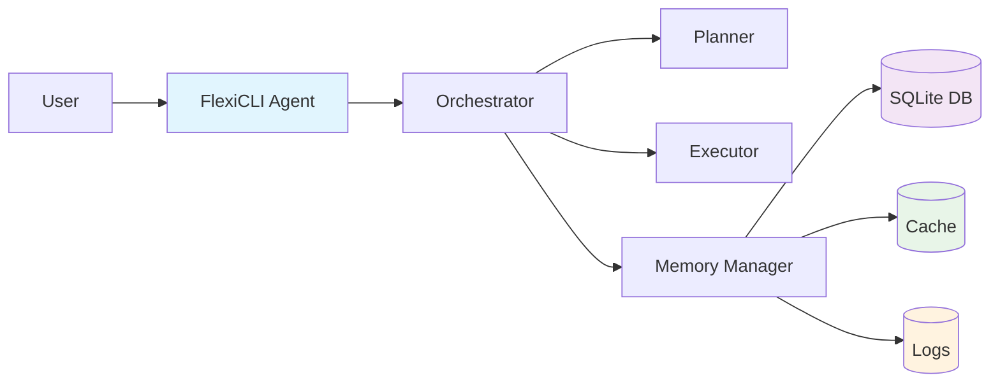
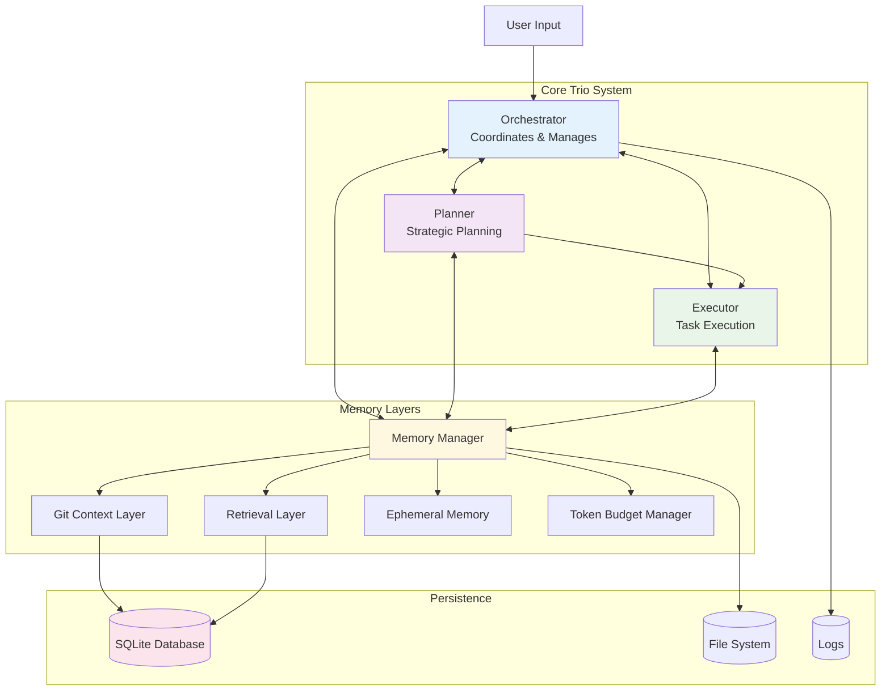

# FlexiCLI - Autonomous AI Agent System

[](https://github.com/FlexiCLI/flexicli)
[](https://deepseek.com)
[](LICENSE)

## Overview

FlexiCLI is a fully autonomous AI agent system featuring a memory-integrated trio architecture (Orchestrator, Planner, Executor) with complete memory persistence, smart state management, and robust error recovery. The system operates entirely autonomously with optional monitoring capabilities, powered by DeepSeek V3.1 with enhanced JSON parsing and token optimization.



## Quick Start

### Prerequisites

- Node.js 18+
- npm or yarn
- Git
- SQLite3

### Installation

```bash
# Clone the repository
git clone https://github.com/FlexiCLI/flexicli.git
cd flexicli

# Install dependencies
npm install

# Set up environment
cp .env.example .env
# Edit .env with your DeepSeek API credentials

# Initialize database
npx prisma migrate deploy
```

### Basic Usage

```bash
# Run agent interactively
npx tsx src/cli.tsx

# Run a single command
npx tsx src/cli.tsx --prompt "Create a simple React app" --non-interactive

# Run with debug mode
DEBUG=true npx tsx src/cli.tsx --prompt "Build a TypeScript API" --non-interactive

# Run with monitoring enabled (optional)
ENABLE_MONITORING=true npx tsx src/cli.tsx --prompt "Your task here" --non-interactive
```

## Key Features

### 🤖 Fully Autonomous Operation

- **No Emergency Fallbacks**: Pure AI-based decision making and error recovery
- **Smart State Management**: Persistent memory across sessions with automatic DB schema validation
- **Robust Error Handling**: AI-powered retry mechanisms with exponential backoff
- **Self-Validating**: Automatic database schema initialization with inline protection comments

### 🏗️ Memory-Integrated Trio Architecture



### 🧠 Advanced Memory Management

- **Git Context Layer**: Automatic code context indexing with vector embeddings
- **Retrieval Layer**: Intelligent context retrieval with similarity search
- **Ephemeral Memory**: Session-based working memory with token budgeting
- **Persistent Storage**: SQLite database with automatic schema validation

### 🔄 Enhanced DeepSeek V3.1 Integration

- **Fixed JSON Parsing**: Robust extraction prioritizing JSON over Mermaid diagrams
- **Dynamic Token Allocation**: Intelligent token limits based on prompt complexity (8K-64K range)
- **Response Optimization**: No truncation, complete response handling
- **Retry Logic**: Exponential backoff with smart error classification

### 📊 Optional Monitoring System

- **Autonomous Operation**: Agent runs independently, monitoring reads data when available
- **Real-time Dashboards**: React-based UI for session tracking (optional)
- **Comprehensive Logging**: All actions logged to database and files
- **Tool Execution Tracking**: Complete audit trail of all operations

## System Architecture

The system operates through a clean separation of concerns:

### Core Components

1. **Orchestrator** (`src/core/orchestrator.ts`)
   - Manages overall workflow and coordination
   - Handles errors with AI-based recovery (no emergency fallbacks)
   - Forwards events to monitoring system

2. **Planner** (`src/core/planner.ts`)
   - Strategic task decomposition using AI planning
   - Returns structured JSON plans with success criteria
   - No hardcoded task templates

3. **Executor** (`src/core/executor.ts`)
   - Executes individual tasks from plans
   - Tool selection and parameter generation
   - Results validation and reporting

4. **Memory Manager** (`src/memory/memory-manager.ts`)
   - Coordinates all memory layers
   - Token budget management
   - Session persistence and recovery

### Data Storage Structure

```
.flexicli/
├── flexicli.db          # SQLite database (auto-created)
├── cache/               # Temporary cache storage
├── logs/               # Session logs (auto-populated)
└── meta.json           # Project metadata
```

### Database Tables

- **Chunk**: Vector embeddings for code context
- **ExecutionLog**: Tool execution audit trail
- **GitCommit**: Git context layer data
- **Knowledge**: Persistent knowledge storage
- **Project**: Project metadata
- **Session**: Session management
- **SessionSnapshot**: State snapshots
- **SchemaVersion**: Migration tracking

## Recent Major Fixes

### v2.0.0 - Autonomous System Overhaul

- ✅ **Emergency Fallback Removal**: Eliminated all hardcoded fallbacks, pure AI decision making
- ✅ **JSON Parsing Fixes**: Robust DeepSeek response parsing, fixed Mermaid extraction bugs
- ✅ **Token Optimization**: Dynamic allocation (8K-64K) prevents truncation
- ✅ **Database Auto-Validation**: Automatic schema initialization with protection comments
- ✅ **Memory Pipeline**: Complete persistence of all layers (chunks, sessions, logs)
- ✅ **Error Recovery**: AI-powered retry mechanisms with exponential backoff
- ✅ **Documentation Cleanup**: Organized structure under `docs/` subfolders

### Critical Bug Fixes

1. **JSON Extraction Priority**: Now correctly extracts JSON when mixed with Mermaid content
2. **Token Limits**: Increased 4x-8x to handle complex planning tasks without truncation
3. **Schema Validation**: Auto-creates database schema on startup, prevents "Table does not exist" errors
4. **Memory Persistence**: All memory layers properly stored and retrieved from database

## Development

### Project Structure

```
src/
├── cli.tsx                 # Main CLI entry point with DB validation
├── core/                   # Orchestrator, Planner, Executor trio
├── memory/                 # Memory management and persistence
├── llm/                    # DeepSeek client with enhanced JSON parsing
├── tools/                  # Tool discovery and execution
├── monitoring/             # Optional monitoring system
└── config/                 # Configuration management

docs/
├── architecture/           # System architecture documentation
├── development/           # Development and implementation notes
├── guides/                # User guides and tutorials
└── research/              # Research and model comparisons
```

### Running Tests

```bash
# Run unit tests
npm test

# Run integration tests
npm run test:integration

# Run with coverage
npm run test:coverage
```

### Contributing

1. Fork the repository
2. Create a feature branch
3. Make your changes with appropriate tests
4. Update documentation if needed
5. Submit a pull request

## Environment Variables

```bash
# DeepSeek API Configuration (Required)
API_KEY=your_deepseek_api_key
ENDPOINT=https://your-deepseek-endpoint.com
MODEL=DeepSeek-V3.1

# Optional Configuration
DEBUG=true                    # Enable debug logging
ENABLE_MONITORING=true        # Enable monitoring system
DATABASE_URL=file:./data.db   # Custom database path
```

## Documentation

- [Architecture Overview](docs/architecture/ARCHITECTURE.md)
- [Memory Pipeline](docs/architecture/MEMORY_PIPELINE.md)
- [Agent Pipeline](docs/architecture/AGENT_PIPELINE.md)
- [Development Guide](docs/development/IMPLEMENTATION_SUMMARY.md)
- [Model Research](docs/research/DEEPSEEK_MODELS_COMPARISON.md)

## License

MIT License - see [LICENSE](LICENSE) file for details.

## Support

For issues and questions:
- GitHub Issues: [FlexiCLI Issues](https://github.com/FlexiCLI/flexicli/issues)
- Documentation: [docs/](docs/)