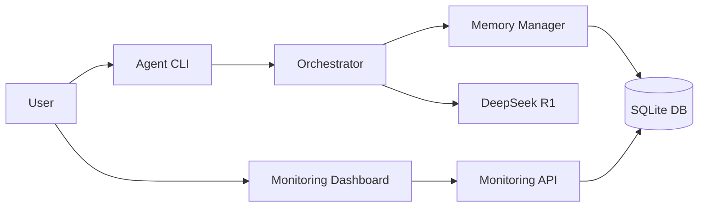
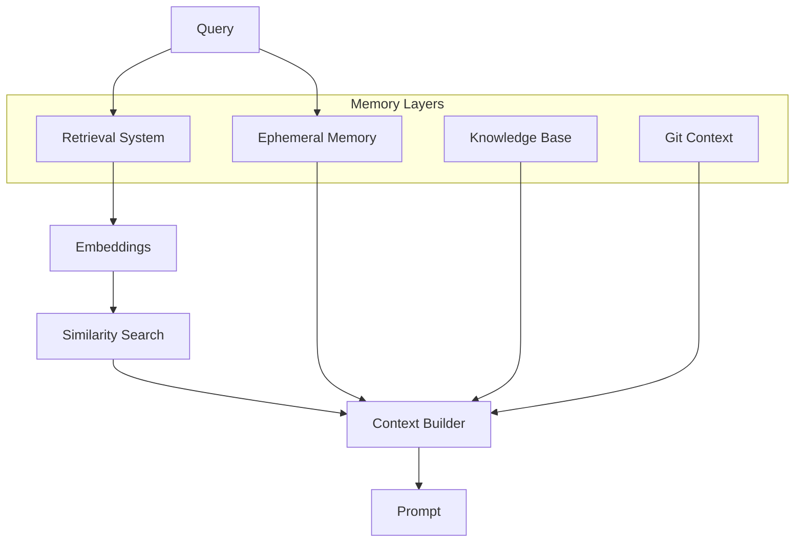

# FlexiCLI - Intelligent CLI with Complete Memory

[](https://github.com/FlexiCLI/flexicli)
[](https://deepseek.com)
[](LICENSE)

## Overview

FlexiCLI is an advanced command-line interface featuring complete memory management, real-time monitoring, and sophisticated token economics optimized for DeepSeek R1 model. It provides autonomous task execution with intelligent context retrieval and comprehensive monitoring capabilities.



## Quick Start

### Prerequisites

- Node.js 18+ 
- npm or yarn
- Git
- SQLite3

### Installation

```bash
# Clone the repository
git clone https://github.com/FlexiCLI/flexicli.git
cd flexicli

# Install dependencies
npm install

# Set up environment
cp .env.example .env
# Edit .env with your API keys
```

### Basic Usage

```bash
# Start monitoring dashboard (optional)
./monitoring.sh start

# Run the agent interactively
./agent.sh

# Run a single command
./agent.sh --prompt "Create a README file"

# Non-interactive with auto-approval
APPROVAL_MODE=yolo ./agent.sh --prompt "Fix the bug" --non-interactive
```

## Key Features

### 🧠 Complete Memory Pipeline



- **Ephemeral Memory**: Recent conversation context
- **Retrieval System**: Vector-based semantic search
- **Knowledge Base**: Project patterns and preferences
- **Git Context**: Version control integration

### 📊 Real-Time Monitoring

Access comprehensive monitoring at http://localhost:3000

- Live token usage tracking
- Memory pipeline visualization
- Performance metrics
- Session history
- Tool execution logs

### 🎯 Token Economics

Optimized for DeepSeek R1 0528:
- **Input**: 128K tokens max
- **Output**: 32K tokens max
- **Reasoning Suppression**: Automatic removal of think tags
- **Mode-based Budgets**: Direct (1K), Concise (6K), Deep (15K)

### 🔧 Tool Ecosystem

13+ integrated tools:
- File operations (Read/Write/Edit)
- Shell execution (Bash commands)
- Web tools (Search/Fetch)
- Memory operations
- Git integration

## Documentation

### Core Documentation

- [🏗️ Architecture](docs/ARCHITECTURE.md) - System design and component overview
- [💰 Token Economics](docs/TOKEN_ECONOMICS.md) - Token management and optimization
- [🧠 Memory Pipeline](MEMORY_PIPELINE_COMPLETE.md) - Complete memory system documentation

### API & Development

- [🔌 API Documentation](_OLD/API_DOCUMENTATION.md) - REST and WebSocket APIs
- [🚀 Development Guide](docs/development/README.md) - Setup and contribution guide
- [🧪 Testing Guide](docs/guides/TESTING.md) - Test suites and validation

### Monitoring

- [📊 Monitoring Guide](docs/monitoring/README.md) - Dashboard features and usage
- [📈 Metrics Documentation](docs/monitoring/METRICS.md) - Available metrics and interpretation

## Scripts

### Control Scripts

| Script | Purpose | Usage |
|--------|---------|-------|
| `agent.sh` | Main agent control | `./agent.sh [options]` |
| `monitoring.sh` | Monitoring control | `./monitoring.sh start\|stop\|status` |
| `test-complete.sh` | Run full test suite | `./test-complete.sh` |

### Options

```bash
# Agent options
--prompt "text"      # Run single command
--non-interactive    # No user interaction
--approval-mode MODE # default|yolo|strict
--help              # Show help

# Environment variables
APPROVAL_MODE       # Set approval mode
ENABLE_MONITORING   # Enable monitoring integration
DEBUG              # Enable debug logging
```

## Project Structure

```
flexicli/
├── src/
│   ├── core/           # Orchestrator and core logic
│   ├── memory/         # Memory management system
│   ├── llm/            # DeepSeek client
│   ├── tools/          # Tool implementations
│   ├── ui/             # React Ink CLI interface
│   └── monitoring/     # Monitoring system
│       ├── backend/    # API server
│       └── react-dashboard/  # Web UI
├── docs/               # Documentation
├── .flexicli/          # Project database
├── agent.sh           # Agent control script
└── monitoring.sh      # Monitoring control script
```

## Testing

```bash
# Run complete test suite
chmod +x test-complete.sh
./test-complete.sh

# Test individual components
./agent.sh --help
./monitoring.sh status
```

## Configuration

### Environment Variables (.env)

```env
# DeepSeek API
DEEPSEEK_API_KEY=your_key_here
DEEPSEEK_MODEL=deepseek-r1-0528

# Azure OpenAI (for embeddings)
AZURE_OPENAI_API_KEY=your_key_here
AZURE_OPENAI_ENDPOINT=https://your-resource.openai.azure.com/
AZURE_OPENAI_DEPLOYMENT=text-embedding-3-large

# Monitoring
MONITORING_PORT=4000
DASHBOARD_PORT=3000

# Agent Settings
DEFAULT_APPROVAL_MODE=default
DEFAULT_OPERATING_MODE=concise
```

## Troubleshooting

### Common Issues

| Issue | Solution |
|-------|----------|
| Port already in use | `./monitoring.sh stop` then restart |
| Token limit exceeded | Switch to concise mode or clear context |
| Embeddings not working | Check Azure OpenAI credentials |
| Database errors | Check `.flexicli/` permissions |

### Debug Mode

```bash
# Enable debug logging
DEBUG=true ./agent.sh

# Check logs
tail -f /tmp/flexicli-*.log
```

## Contributing

We welcome contributions! Please see our [Contributing Guide](CONTRIBUTING.md) for details.

1. Fork the repository
2. Create a feature branch
3. Make your changes
4. Add tests
5. Submit a pull request

## License

MIT License - see [LICENSE](LICENSE) file for details.

## Support

- 📧 Email: support@flexicli.ai
- 💬 Discord: [Join our community](https://discord.gg/flexicli)
- 🐛 Issues: [GitHub Issues](https://github.com/FlexiCLI/flexicli/issues)

## Acknowledgments

- DeepSeek for the R1 model
- Azure OpenAI for embeddings
- React Ink for CLI interface
- The open-source community

---

**FlexiCLI v1.0.0** | Built with ❤️ by Mike Admon | Powered by DeepSeek R1