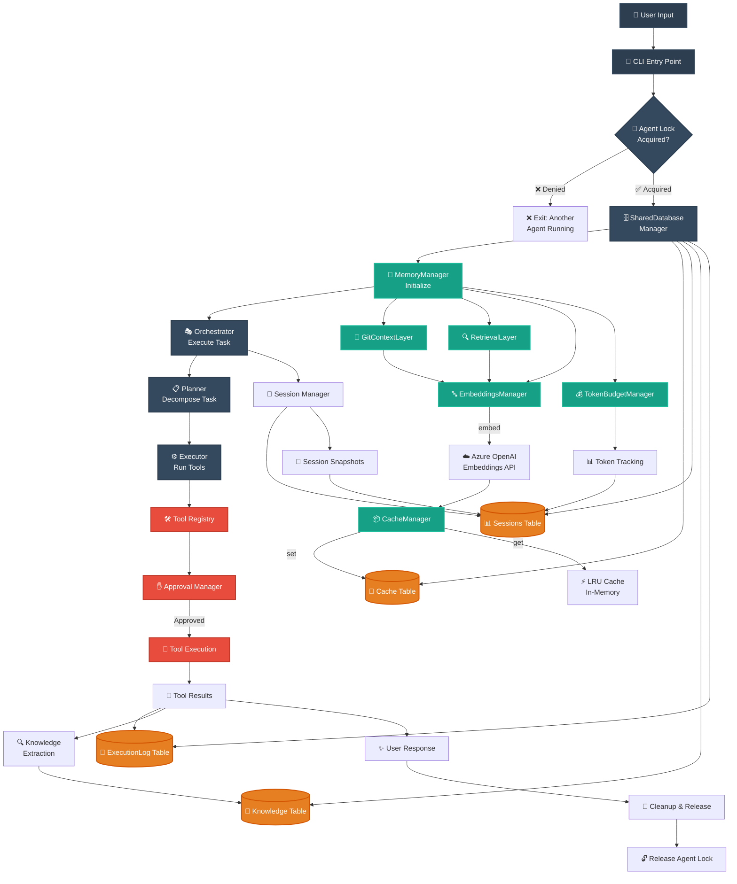

# FlexiCLI

**Autonomous AI Agent with Advanced Memory Management**

A production-ready CLI tool that combines autonomous task execution with sophisticated memory persistence and intelligent conversation management.

---

## 🚀 Features

### Core Capabilities
- **Autonomous Task Execution** - Multi-step planning and execution with real-time feedback
- **Advanced Memory Management** - Persistent sessions with crash recovery and knowledge accumulation
- **Token Budget Management** - Intelligent token allocation across memory layers
- **Real-time Tool Execution** - Comprehensive tool registry with approval management
- **Database Persistence** - Complete audit trails and session state preservation

### Memory System
- **Session Management** - Automatic crash recovery and state restoration
- **Knowledge Accumulation** - Semantic understanding capture and retrieval
- **Execution Logging** - Complete audit trail of all tool executions
- **Token Tracking** - Precise monitoring of LLM API usage

---

## 🏗️ Architecture

### Core Components
```
FlexiCLI/
├── src/
│   ├── core/           # Orchestrator, Planner, Executor
│   ├── memory/         # Memory management system
│   ├── tools/          # Tool registry and execution
│   ├── llm/            # LLM provider integration
│   ├── config/         # Configuration management
│   └── approval/       # User approval system
├── .flexicli/          # Runtime data directory
│   ├── flexicli.db     # SQLite database
│   ├── logs/           # Application logs
│   └── meta.json       # Project metadata
```

### Memory-Agent Flow Architecture



### Database Schema
- **Sessions** - User session state and metadata
- **SessionSnapshots** - Point-in-time session backups
- **ExecutionLog** - Complete tool execution audit trail
- **Knowledge** - Accumulated semantic understanding
- **Cache** - Embeddings cache with TTL and persistence
- **Chunks** - Vector embeddings for retrieval

---

## 📦 Installation

### Prerequisites
- Node.js (v18 or higher)
- npm or yarn

### Setup
```bash
# Clone the repository
git clone <repository-url>
cd flexicli

# Install dependencies
npm install

# Initialize the system
npx tsx src/cli.tsx --prompt "test installation"
```

---

## 🎯 Usage

### Basic Execution
```bash
# Interactive mode
npx tsx src/cli.tsx

# Non-interactive with prompt
npx tsx src/cli.tsx --prompt "Create a TypeScript function to calculate fibonacci"

# Debug mode
DEBUG=true npx tsx src/cli.tsx --prompt "your task"

# Approval-free mode
APPROVAL_MODE=yolo npx tsx src/cli.tsx --prompt "your task"
```

### Environment Variables
```bash
# Core Configuration
DEBUG=true                    # Enable debug logging
APPROVAL_MODE=yolo           # Skip user approval prompts
ENABLE_MONITORING=false      # Disable UI monitoring

# LLM Configuration
DEEPSEEK_API_KEY=your-key    # DeepSeek API key
OPENAI_API_KEY=your-key      # OpenAI API key (alternative)

# Database Configuration
DATABASE_URL=file:./custom.db # Custom database location
```

---

## 🧠 Memory Management

### Operating Modes
- **Concise** - Optimized for quick responses (default)
- **Detailed** - Extended context for complex tasks
- **Comprehensive** - Maximum memory allocation

### Memory Layers
1. **Ephemeral** - Current conversation context
2. **Retrieved** - Relevant historical information
3. **Knowledge** - Accumulated project understanding
4. **Git Context** - Repository state and changes

### Session Recovery
FlexiCLI automatically:
- Detects crashed sessions
- Restores conversation state
- Preserves working context
- Maintains knowledge continuity

---

## 🔧 Configuration

### Project Configuration
```json
// .flexicli/meta.json
{
  "projectId": "unique-project-id",
  "name": "project-name",
  "rootPath": "/absolute/path/to/project",
  "gitRepo": true,
  "createdAt": "2025-01-15T10:30:00.000Z"
}
```

### Tool Permissions
```json
// .claude/settings.local.json
{
  "permissions": {
    "allow": ["Bash(npm install:*)", "Read(**/*.ts)"],
    "deny": ["Bash(rm -rf:*)"],
    "ask": ["Bash(git push:*)"]
  }
}
```

---

## 🛠️ Development

### Project Structure
```
src/
├── core/
│   ├── orchestrator.ts     # Main execution coordinator
│   ├── planner.ts          # Task planning and decomposition
│   └── executor.ts         # Tool execution engine
├── memory/
│   ├── memory-manager.ts   # Memory orchestration
│   ├── session-manager.ts  # Session lifecycle
│   ├── token-budget.ts     # Token allocation
│   └── layers/             # Memory layer implementations
├── tools/
│   ├── registry.ts         # Tool registration system
│   ├── auto-discovery.ts   # Dynamic tool loading
│   └── implementations/    # Tool implementations
└── llm/
    ├── provider.ts         # LLM provider interface
    └── deepseek-client.ts  # DeepSeek integration
```

### Building and Testing
```bash
# Type checking
npx tsc --noEmit

# Run tests
npm test

# Real agent testing
DEBUG=true npx tsx test-token-real-agent.ts
```

---

## 📊 Monitoring

### Database Inspection
```bash
# Session overview
sqlite3 .flexicli/flexicli.db "SELECT id, mode, tokensUsed, turnCount FROM Session ORDER BY startedAt DESC LIMIT 5;"

# Knowledge entries
sqlite3 .flexicli/flexicli.db "SELECT key, LENGTH(value), createdAt FROM Knowledge ORDER BY createdAt DESC LIMIT 5;"

# Execution logs
sqlite3 .flexicli/flexicli.db "SELECT tool, duration, success, createdAt FROM ExecutionLog ORDER BY createdAt DESC LIMIT 10;"
```

### Performance Metrics
- Token usage tracking
- Execution time monitoring
- Memory allocation optimization
- Database query performance

---

## 🔒 Security

### Best Practices
- **Tool Permissions** - Granular control over tool execution
- **Approval System** - User confirmation for sensitive operations
- **Database Isolation** - Project-specific data separation
- **Secret Management** - Environment variable configuration
- **Audit Trails** - Complete execution logging

### Safe Defaults
- Approval required for destructive operations
- Read-only access by default
- Isolated project environments
- Comprehensive logging enabled

---

## 📈 Production Deployment

### System Requirements
- Node.js 18+ runtime
- SQLite 3.x
- 1GB+ available memory
- Persistent storage for database

### Configuration
```bash
# Production environment
export NODE_ENV=production
export DATABASE_URL=file:/opt/flexicli/production.db
export LOG_LEVEL=info

# Start the service
npx tsx src/cli.tsx --non-interactive
```

---

## 📚 Documentation

Comprehensive documentation is available in the [`docs/`](./docs/) directory:

### 🏗️ Architecture
- **[System Architecture](./docs/architecture/ARCHITECTURE.md)** - Complete system overview with Mermaid diagrams
- **[Agent Pipeline](./docs/architecture/AGENT_PIPELINE.md)** - Orchestrator→Planner→Executor flow
- **[Memory Pipeline](./docs/architecture/MEMORY_PIPELINE.md)** - Memory layer coordination and data flow
- **[Monitoring Integration](./docs/architecture/MONITORING_INTEGRATION_ARCHITECTURE.md)** - Real-time monitoring architecture

### 🧪 Testing & Development
- **[Testing Guide](./docs/TESTING.md)** - Complete testing documentation and coverage
- **[Test Execution Report](./docs/TEST_EXECUTION_REPORT.md)** - Latest test results and metrics
- **[Implementation Summary](./docs/development/IMPLEMENTATION_SUMMARY.md)** - Technical implementation details
- **[Final Implementation Report](./docs/development/FINAL_IMPLEMENTATION_REPORT.md)** - Complete implementation analysis
- **[System Autonomy Requirements](./docs/development/SYSTEM_AUTONOMY_REQUIREMENTS.md)** - Autonomous execution capabilities

### 🔬 Research & Analysis
- **[DeepSeek Models Comparison](./docs/research/DEEPSEEK_MODELS_COMPARISON.md)** - Model selection and optimization
- **[Token Economics](./docs/research/TOKEN_ECONOMICS.md)** - Token usage analysis and budgeting

---

## ⚠️ Private Software

This is **PROPRIETARY SOFTWARE** - All rights reserved.
**NOT** open source. **NOT** MIT/Apache licensed.

---

*Built with bulletproof methodology and validated through comprehensive real agent testing.*