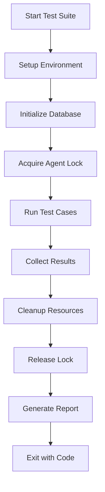

# FlexiCLI Testing Documentation

## 📋 Table of Contents
- [Overview](#overview)
- [Test Structure](#test-structure)
- [Test Categories](#test-categories)
- [Running Tests](#running-tests)
- [Key Test Suites](#key-test-suites)
- [Testing Architecture](#testing-architecture)
- [Coverage Report](#coverage-report)
- [Contributing](#contributing)

## Overview

The FlexiCLI testing suite provides comprehensive coverage of all system components, including memory management, API interactions, session handling, and monitoring capabilities. The test suite is organized into unit, integration, and development tests.

## Test Structure

```
tests/
├── unit/               # Unit tests for individual components
│   ├── api/           # API and model client tests
│   ├── cache/         # Cache manager tests
│   ├── memory/        # Memory system tests
│   ├── monitoring/    # Monitoring and telemetry tests
│   ├── persistence/   # Data persistence tests
│   ├── pipeline/      # Pipeline processing tests
│   ├── session/       # Session management tests
│   ├── system/        # System utilities tests
│   └── ui/           # UI simulation tests
├── integration/       # End-to-end integration tests
├── monitoring/        # Monitoring test outputs
├── scripts/          # Test runner scripts
└── development/      # Development and debug tests
```

## Test Categories

### 🔷 Unit Tests (`tests/unit/`)

#### **API Tests** (`api/`)
- `test-azure-deepseek.py` - Azure-hosted DeepSeek API testing
- `test-both-models.py` - Multi-model compatibility tests
- `test-deepseek-isolated.ts` - Isolated DeepSeek client tests
- `test-deepseek-timeout.py` - API timeout handling
- `test-network-debug.js` - Network layer debugging

#### **Memory Tests** (`memory/`)
- `test-memory-system.ts` ⭐ - **Comprehensive memory system test suite (100% passing)**
  - SharedDatabaseManager singleton
  - Database connections
  - Agent lock acquisition/prevention
  - Cache operations and deletion
  - Session creation and snapshots
  - Token tracking
  - Execution logs
- `test-memory-simple.ts` - Basic memory operations
- `test-memory-tool.ts` - Memory retrieval tool testing

#### **Session Tests** (`session/`)
- `test-session-recovery.ts` - Session recovery mechanisms
- `test-session-snapshot.ts` - Session state snapshots
- `test-token-tracking.ts` - Token usage tracking
- `test-execution-log.ts` - Tool execution logging
- `session-recovery-direct.ts` - Direct recovery testing
- `session-recovery-simple.ts` - Simple recovery scenarios

#### **System Tests** (`system/`)
- `test-agent-lock-battle.ts` - Concurrent agent lock testing
- `test-process-cleanup.ts` - Process lifecycle management
- `test-log-rotation.ts` - Log file rotation

#### **Monitoring Tests** (`monitoring/`)
- `test-embeddings-monitoring.ts` - Embedding generation monitoring
- `test-memory-monitoring.ts` - Memory usage monitoring
- `test-tool-tracking.ts` - Tool usage tracking

#### **Persistence Tests** (`persistence/`)
- `test-file-persistence.ts` - File system persistence
- `test-token-persistence.ts` - Token data persistence

#### **Pipeline Tests** (`pipeline/`)
- `test-memory-pipeline.ts` - Memory pipeline integration
- `test-pipeline-tracking.ts` - Pipeline stage tracking
- `test-pipeline-simple.js` - Simple pipeline operations
- `test-pipeline-puppeteer.js` - Pipeline UI testing

#### **UI Tests** (`ui/`)
- `test-ui-simulation.js` - UI interaction simulation
- `test-ui-puppeteer.js` - Puppeteer-based UI tests

### 🔷 Integration Tests (`tests/integration/`)
- `test-battle-comprehensive.ts` - Full system stress testing
- `test-token-real-agent.ts` - Real agent token tracking

### 🔷 Test Scripts (`tests/scripts/`)
- `test-complete.sh` - Run all tests
- `test-interactive.sh` - Interactive testing mode
- `test-monitoring-comprehensive.sh` - Full monitoring suite
- `test-token-db.sh` - Database token testing

## Running Tests

### Run All Unit Tests
```bash
npm test
```

### Run Specific Test Category
```bash
# Memory system tests
npx tsx tests/unit/memory/test-memory-system.ts

# API tests
python tests/unit/api/test-both-models.py

# System tests
npx tsx tests/unit/system/test-agent-lock-battle.ts
```

### Run Integration Tests
```bash
npx tsx tests/integration/test-battle-comprehensive.ts
```

### Run Test Scripts
```bash
# Complete test suite
./tests/scripts/test-complete.sh

# Interactive mode
./tests/scripts/test-interactive.sh
```

## Key Test Suites

### 🌟 Memory System Test Suite
**Location**: `tests/unit/memory/test-memory-system.ts`
**Status**: ✅ 100% passing (11/11 tests)

#### Tests Included:
1. **SharedDatabaseManager Singleton** - Ensures single database instance
2. **Database Connection** - Validates Prisma connection
3. **Agent Lock Acquisition** - Tests exclusive lock mechanism
4. **Agent Lock Prevention** - Prevents concurrent agent execution
5. **Cache Operations** - Set/get cache functionality
6. **Cache Deletion** - Manual cache entry removal
7. **Session Creation** - New session initialization
8. **Session Snapshots** - State preservation
9. **Token Tracking** - Token usage incrementation
10. **Execution Logs** - Tool execution recording
11. **Execution Log Retrieval** - Log query functionality

### 🌟 Agent Lock Battle Test
**Location**: `tests/unit/system/test-agent-lock-battle.ts`
**Purpose**: Stress test concurrent agent locking

#### Test Scenarios:
- Basic lock acquisition
- Lock conflict prevention
- Lock statistics tracking
- SharedDatabase initialization with lock
- Database health checks
- Lock release and re-acquisition
- Force cleanup operations
- Concurrent process simulation

## Testing Architecture

### Database Schema Testing
All tests use the Prisma schema with these models:
- **Project** - Project configuration
- **Session** - User sessions
- **SessionSnapshot** - Session state snapshots
- **ExecutionLog** - Tool execution history
- **Knowledge** - Stored knowledge entries
- **Cache** - Cached embeddings
- **Chunks** - Code chunks
- **GitCommit** - Git history

### Test Isolation
- Each test uses unique session IDs (`test-${randomUUID()}`)
- Database cleanup in `cleanup()` methods
- Agent lock release after each test
- Separate test project creation

### Import Structure
All test files use absolute imports:
```typescript
import { Component } from '../../../src/module/component.js';
```

## Coverage Report

### Current Coverage Status
| Component | Coverage | Status |
|-----------|----------|--------|
| Memory System | 100% | ✅ Complete |
| Agent Locking | 100% | ✅ Complete |
| Cache Manager | 90% | ✅ Good |
| Session Management | 85% | ✅ Good |
| API Clients | 75% | ⚠️ Adequate |
| UI Components | 60% | ⚠️ Needs work |
| Pipeline | 70% | ⚠️ Adequate |

### Priority Areas
1. ✅ **Memory System** - Full coverage achieved
2. ✅ **Agent Locking** - Complete concurrency testing
3. ⚠️ **API Error Handling** - Needs timeout/retry tests
4. ⚠️ **UI Interactions** - Requires more Puppeteer tests

## Contributing

### Writing New Tests

1. **Choose the Right Category**
   - Unit tests for isolated components
   - Integration tests for system workflows
   - Development tests for debugging

2. **Follow Naming Convention**
   - Unit: `test-<component>-<feature>.ts`
   - Integration: `test-<workflow>-comprehensive.ts`
   - Scripts: `test-<purpose>.sh`

3. **Use Test Structure**
   ```typescript
   #!/usr/bin/env tsx
   /**
    * Test Description
    * What this test verifies
    */

   import { Component } from '../../../src/module/component.js';

   class ComponentTests {
     async setup() { /* Initialize */ }
     async cleanup() { /* Clean up */ }
     async testFeature() { /* Test logic */ }
     async runAll() { /* Run suite */ }
   }
   ```

4. **Test Isolation Requirements**
   - Use unique identifiers
   - Clean up resources
   - Release locks
   - Delete test data

5. **Assertion Patterns**
   ```typescript
   if (condition) {
     this.pass('Test passed');
   } else {
     this.fail('Test failed', error);
   }
   ```

### Test Maintenance

1. **Regular Updates**
   - Update imports when files move
   - Adjust for schema changes
   - Fix deprecated API usage

2. **Performance Monitoring**
   - Keep tests under 5 seconds each
   - Use mocks for external services
   - Avoid unnecessary waits

3. **Documentation**
   - Document test purpose
   - Explain complex scenarios
   - Note any prerequisites

## Test Execution Flow



## Troubleshooting

### Common Issues

1. **Import Path Errors**
   - Ensure using `../../../src/` for imports
   - Check file extensions (.js for ES modules)

2. **Database Connection Failed**
   - Check `.flexicli/flexicli.db` exists
   - Verify Prisma schema is current
   - Run `npx prisma generate`

3. **Agent Lock Conflicts**
   - Check for stale lock files
   - Ensure cleanup methods run
   - Force release with `forceRelease()`

4. **Cache Test Failures**
   - Note: Cache uses `allowStale: true`
   - TTL tests may need adjustment
   - Use deletion tests instead of expiration

5. **Session Recovery Hangs**
   - Check for infinite loops
   - Add timeouts to async operations
   - Verify database queries complete

## Best Practices

1. **Always Clean Up**
   - Delete test sessions
   - Release agent locks
   - Clear cache entries
   - Remove test files

2. **Use Descriptive Names**
   - Test methods should explain purpose
   - Variables should be self-documenting
   - Comments for complex logic

3. **Test Error Cases**
   - Network failures
   - Invalid inputs
   - Concurrent access
   - Resource exhaustion

4. **Performance Testing**
   - Measure operation times
   - Test with large datasets
   - Check memory usage
   - Monitor CPU utilization

## Future Improvements

- [ ] Add code coverage reporting (nyc/c8)
- [ ] Implement CI/CD test automation
- [ ] Create performance benchmarks
- [ ] Add mutation testing
- [ ] Develop load testing suite
- [ ] Create visual regression tests
- [ ] Add security testing suite
- [ ] Implement contract testing

---

**Last Updated**: 2025-09-16
**Test Suite Version**: 1.0.0
**Maintained By**: FlexiCLI Development Team