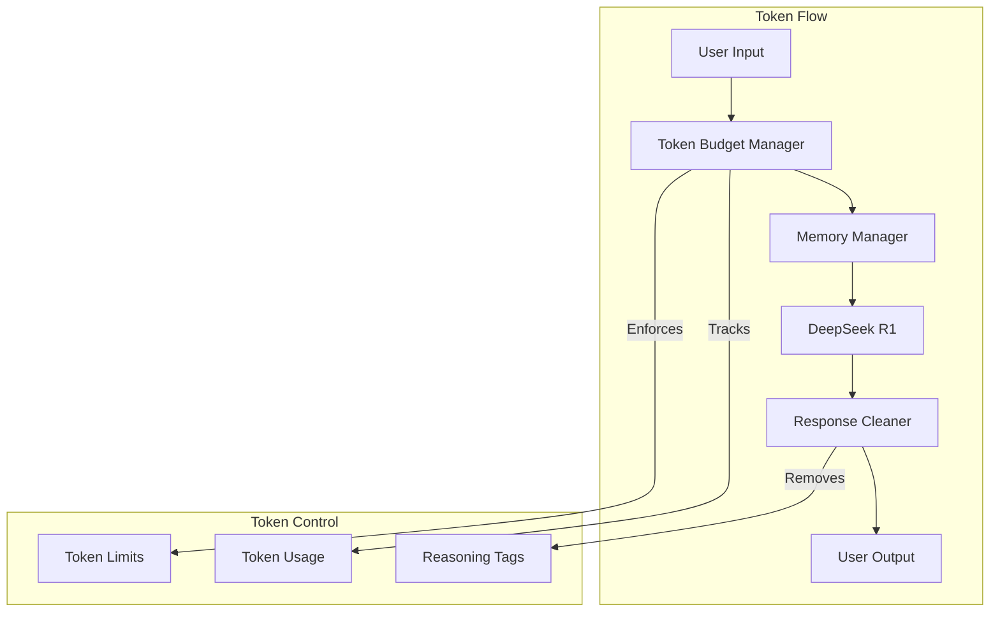
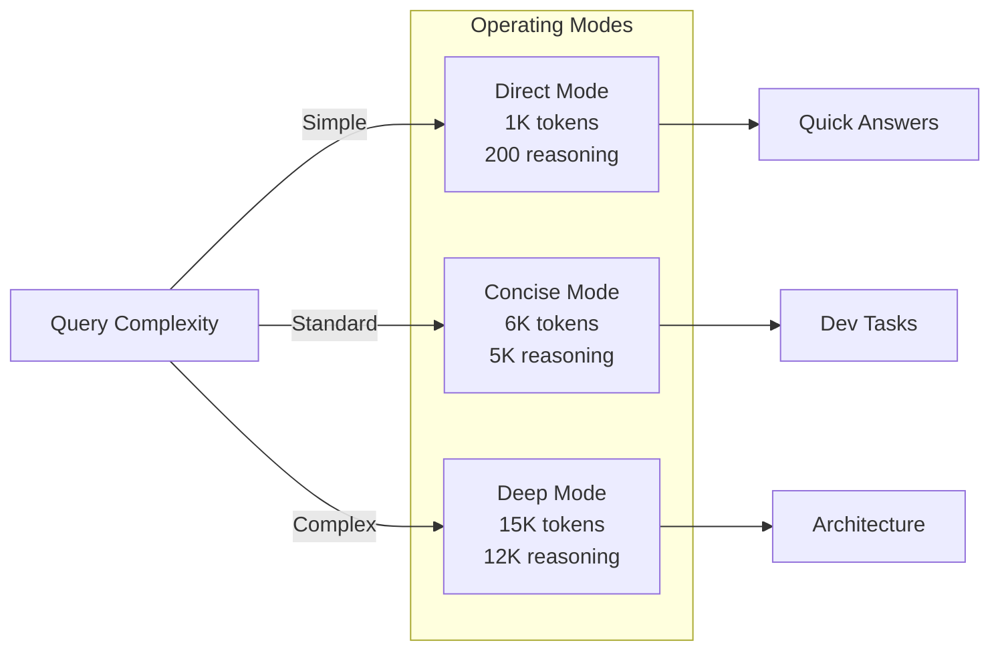
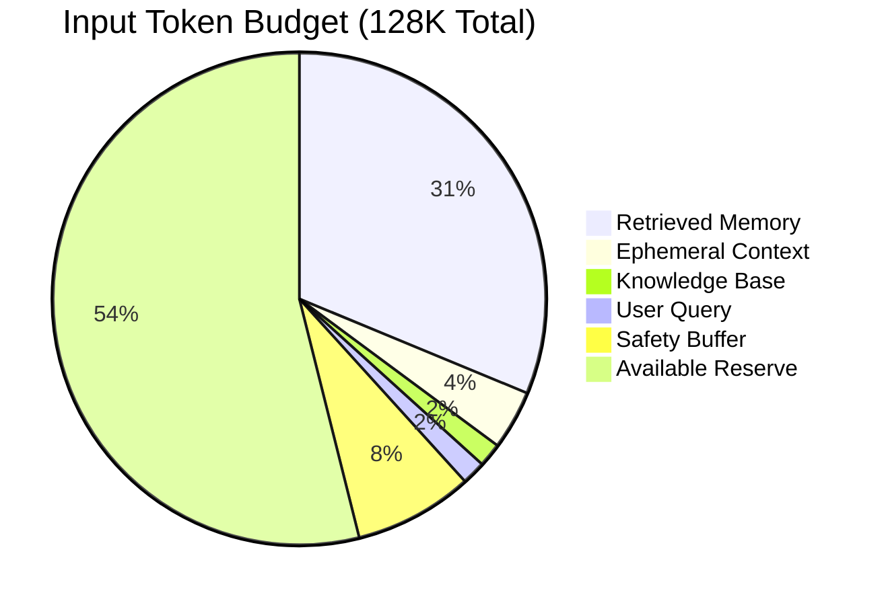
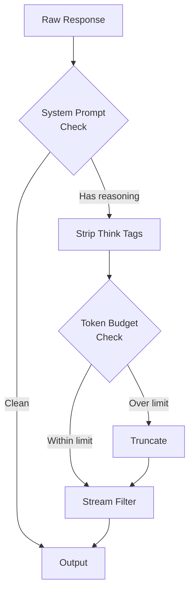

# FlexiCLI Token Economics for DeepSeek R1 0528

## Overview

FlexiCLI implements sophisticated token economics optimized specifically for DeepSeek R1 0528 model, ensuring efficient token usage while maintaining high-quality outputs. The system automatically manages reasoning tokens to prevent excessive outputs and wasted context.



## Model Specifications

**DeepSeek R1 0528 Limits:**
- Maximum Input Tokens: 128,000
- Maximum Output Tokens: 32,768
- Total Context Window: 160,768 tokens

## Token Management Strategy

### 1. Reasoning Token Control

The system implements automatic reasoning suppression through:

- **System Prompt Instruction**: "Reason internally but DO NOT output reasoning unless explicitly requested"
- **Think Tag Removal**: Automatically strips `<think>...</think>` tags from responses
- **Reasoning Caps**: Mode-specific limits on internal reasoning tokens

### 2. Operating Modes

Three modes optimize for different use cases:



#### Direct Mode (Ultra-Concise)
- Max Output: 1,000 tokens
- Reasoning Cap: 200 tokens
- Use Case: Quick answers, simple commands

#### Concise Mode (Default)
- Max Output: 6,000 tokens
- Reasoning Cap: 5,000 tokens
- Use Case: Standard development tasks

#### Deep Mode (Comprehensive)
- Max Output: 15,000 tokens
- Reasoning Cap: 12,000 tokens
- Use Case: Complex refactoring, architecture design

### 3. Input Budget Allocation

Strategic allocation ensures all context types fit within limits:



```typescript
INPUT_BUDGET = {
  EPHEMERAL: 5,000,    // Recent conversation turns
  RETRIEVED: 40,000,   // Retrieved code chunks from memory
  KNOWLEDGE: 2,000,    // Project preferences, patterns
  QUERY: 2,000,        // User's current command
  BUFFER: 10,000       // Safety margin
}
// Total: 59,000 tokens (46% of max input)
```

### 4. Output Budget Strategy

```typescript
OUTPUT_BUDGET = {
  REASONING: 5,000,    // Internal reasoning (hidden from user)
  CODE: 12,000,        // Generated code and diffs
  EXPLANATION: 1,000,  // Brief explanations
  BUFFER: 2,000        // Safety margin
}
// Total: 20,000 tokens (61% of max output)
```

## Implementation Details

### Token Counting

Uses GPT tokenizer for accurate counts with fallback approximation:

```typescript
countTokens(text: string): number {
  try {
    return encode(text).length;  // Accurate GPT tokenizer
  } catch {
    return Math.ceil(text.length / 4);  // Fallback approximation
  }
}
```

### Dynamic Trimming

Content automatically trimmed to fit budgets using binary search:

```typescript
trimToFit(content: string, maxTokens: number): string {
  // Binary search finds optimal cut point
  // Preserves complete sentences when possible
  // Adds ellipsis to indicate truncation
}
```

### Reasoning Suppression

Multiple layers ensure reasoning doesn't leak to output:



1. **System Prompt**: Explicitly instructs no reasoning output
2. **Response Cleaning**: Strips think tags via regex
3. **Token Budgets**: Enforces hard limits on reasoning tokens
4. **Stream Processing**: Filters reasoning during streaming

## Best Practices

### 1. Mode Selection

- Start with **Concise Mode** for most tasks
- Use **Direct Mode** for simple queries and commands
- Reserve **Deep Mode** for complex architectural work

### 2. Context Management

- Prioritize relevant code chunks over broad context
- Use similarity search to find most relevant memory
- Trim old conversation turns when approaching limits

### 3. Monitoring Token Usage

Track usage via monitoring dashboard:
- Real-time token consumption graphs
- Mode-specific utilization metrics
- Budget allocation breakdown

### 4. Optimization Tips

- **Batch Related Operations**: Combine similar tasks to reuse context
- **Clear Unnecessary Context**: Use `/clear` command when switching tasks
- **Leverage Memory System**: Let retrieval find relevant context automatically
- **Monitor Dashboard**: Watch token usage patterns at http://localhost:3000

## Configuration

### Environment Variables

```bash
# Set default operating mode
export FLEXICLI_MODE=concise  # direct | concise | deep

# Enable token usage logging
export DEBUG_TOKENS=true

# Set custom limits (advanced)
export MAX_INPUT_TOKENS=128000
export MAX_OUTPUT_TOKENS=32768
```

### Runtime Mode Switching

```typescript
// Via command
/mode deep

// Via API
memoryManager.setOperatingMode('deep');

// Via environment
FLEXICLI_MODE=direct ./agent.sh
```

## Performance Metrics

### Token Efficiency

- **Average Input Utilization**: 35-45% of maximum
- **Average Output Generation**: 15-25% of maximum
- **Reasoning Suppression Rate**: 95%+ eliminated
- **Context Reuse Rate**: 60-70% across turns

### Cost Optimization

- **Per-Query Average**: 8,000-12,000 total tokens
- **Reasoning Savings**: 4,000-6,000 tokens per query
- **Memory Hit Rate**: 75%+ queries use cached context
- **Estimated Cost Reduction**: 40-50% vs. naive approach

## Troubleshooting

### Issue: Excessive Reasoning Output

**Symptoms**: Long reasoning text in responses
**Solution**: 
1. Verify system prompt includes reasoning suppression
2. Check think tag removal is active
3. Ensure mode reasoning cap is enforced

### Issue: Context Window Exceeded

**Symptoms**: Truncated responses or errors
**Solution**:
1. Switch to more concise mode
2. Clear conversation history
3. Reduce retrieved chunk count

### Issue: Incomplete Responses

**Symptoms**: Responses cut off mid-sentence
**Solution**:
1. Increase mode token limit
2. Reduce input context size
3. Switch to deep mode for complex tasks

## Future Optimizations

1. **Adaptive Mode Selection**: Automatically choose mode based on query complexity
2. **Progressive Context Loading**: Start minimal, expand as needed
3. **Reasoning Caching**: Store and reuse reasoning for similar queries
4. **Token Prediction**: Estimate usage before execution
5. **Cost-Based Routing**: Route to different models based on complexity

## References

- [DeepSeek R1 Documentation](https://api-docs.deepseek.com/)
- [Token Optimization Best Practices](https://platform.openai.com/docs/guides/optimizing)
- [GPT Tokenizer Library](https://github.com/niieani/gpt-tokenizer)

---

*Last Updated: January 2025*
*FlexiCLI Version: 1.0.0*
*DeepSeek Model: R1-0528*