# FlexiCLI Architecture Documentation

## System Overview

FlexiCLI is an advanced command-line interface with complete memory management, real-time monitoring, and sophisticated token economics optimized for DeepSeek R1 model.

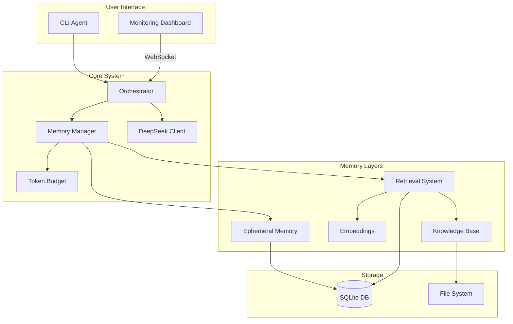

## Component Architecture

### 1. Agent System

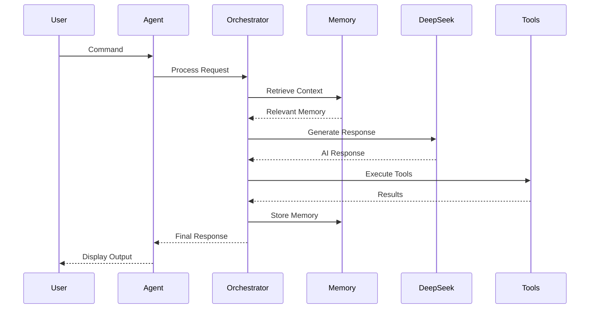

### 2. Memory Pipeline

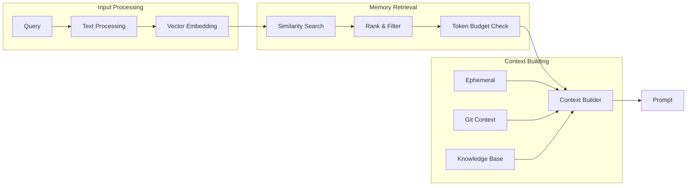

### 3. Monitoring System

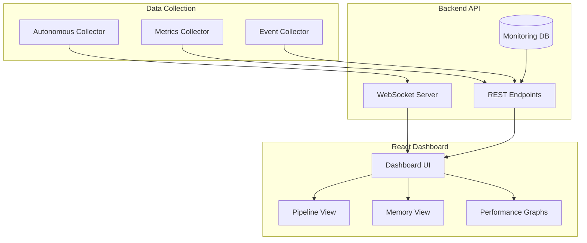

## Data Flow

### Request Processing Flow

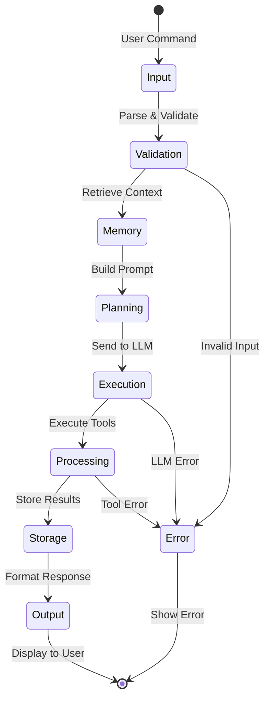

### Memory Lifecycle

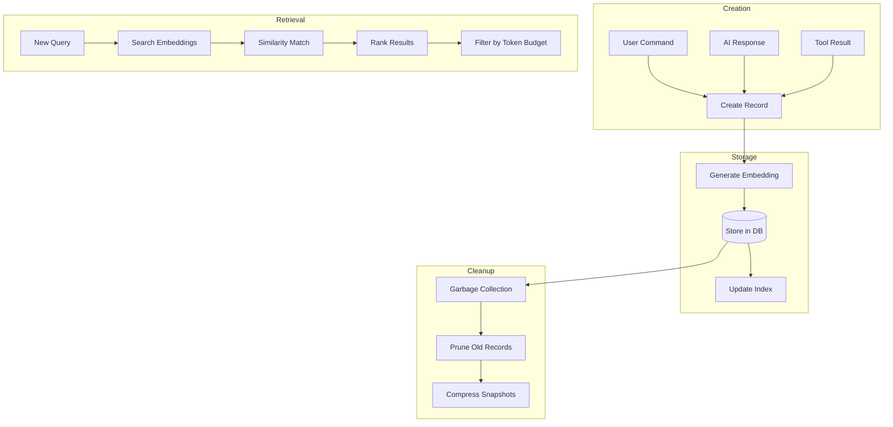

## System Components

### Core Services

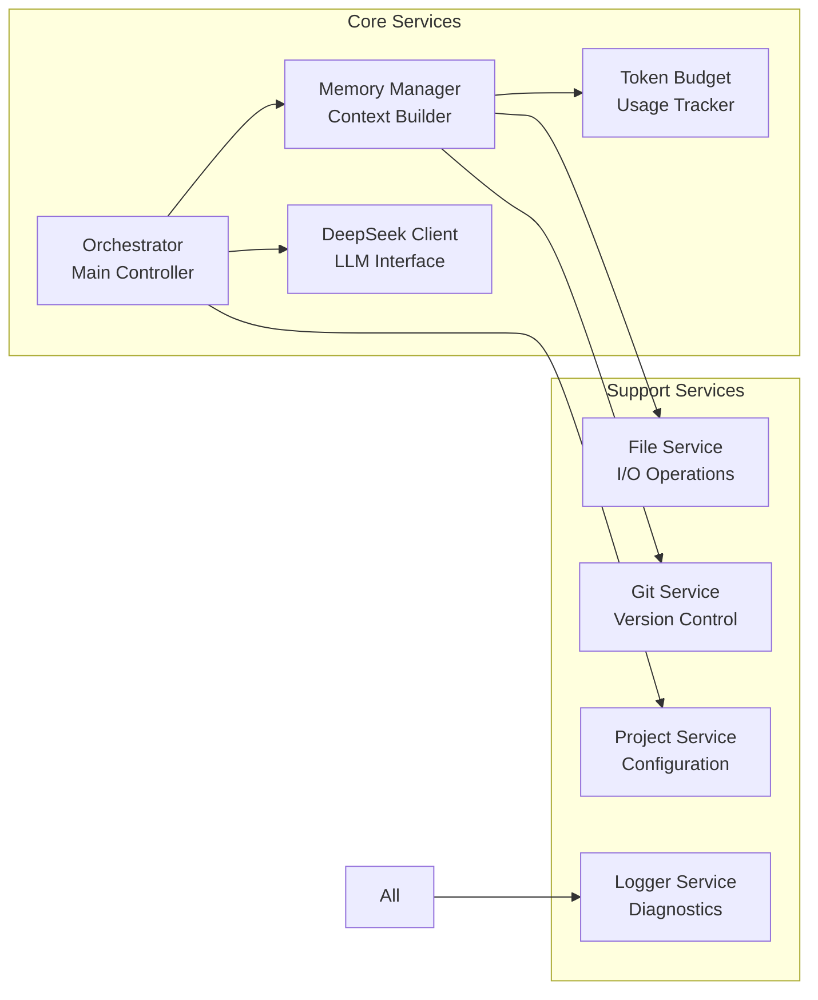

### Tool Registry

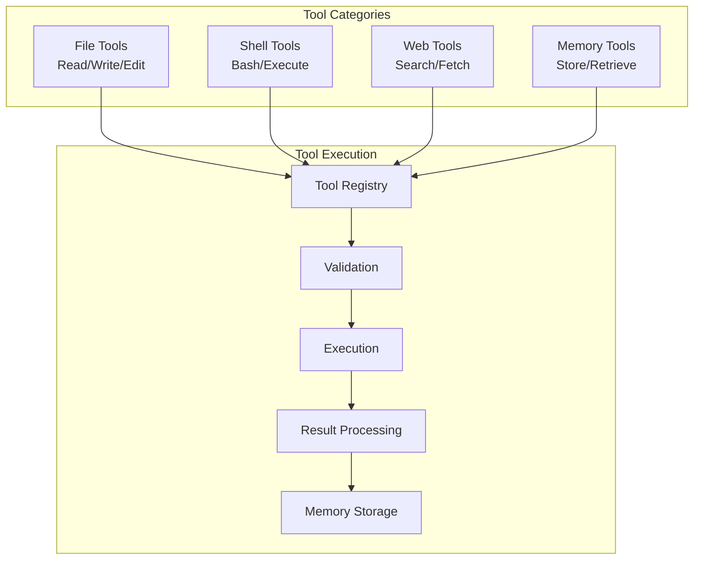

## Deployment Architecture

### Production Setup

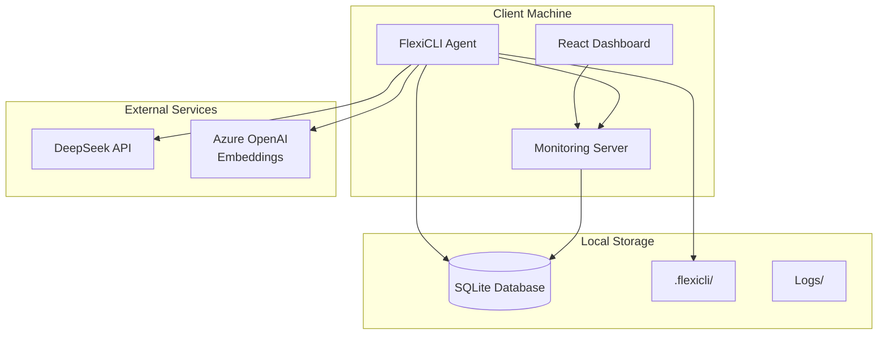

### Process Management

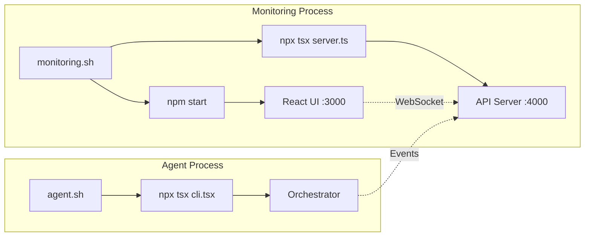

## Security Architecture

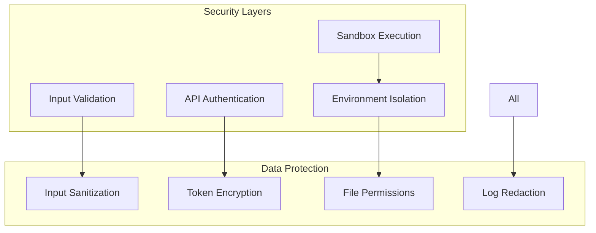

## Performance Optimization

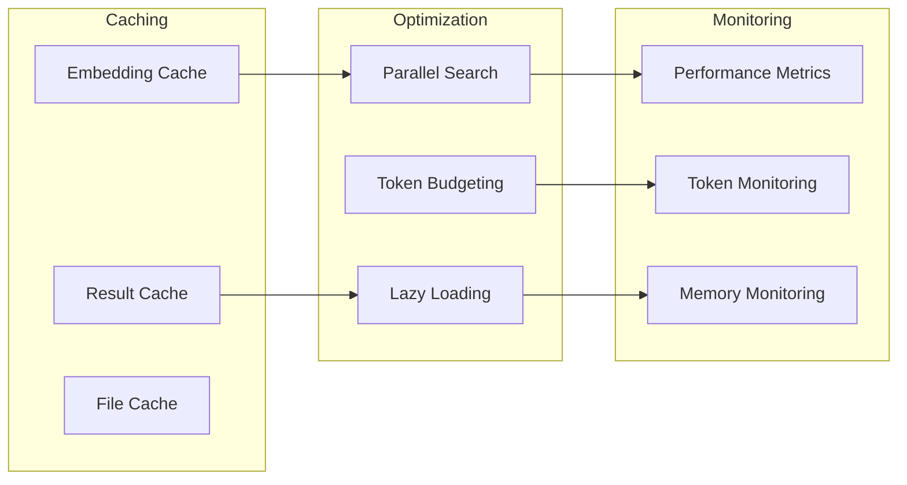

## Error Handling

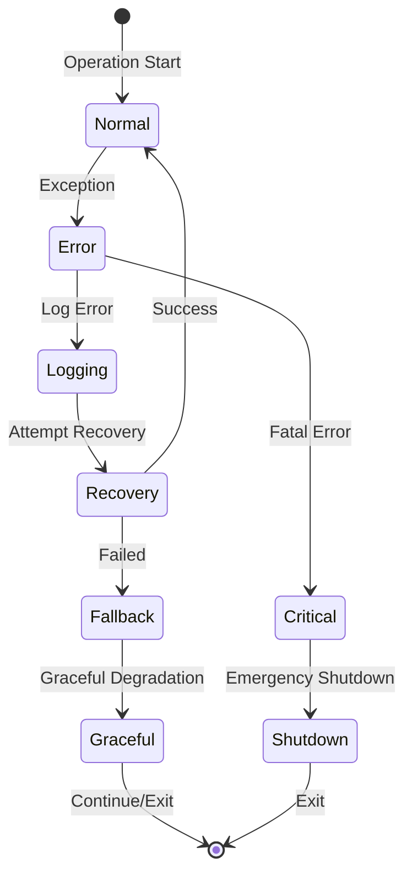

## Scalability Design

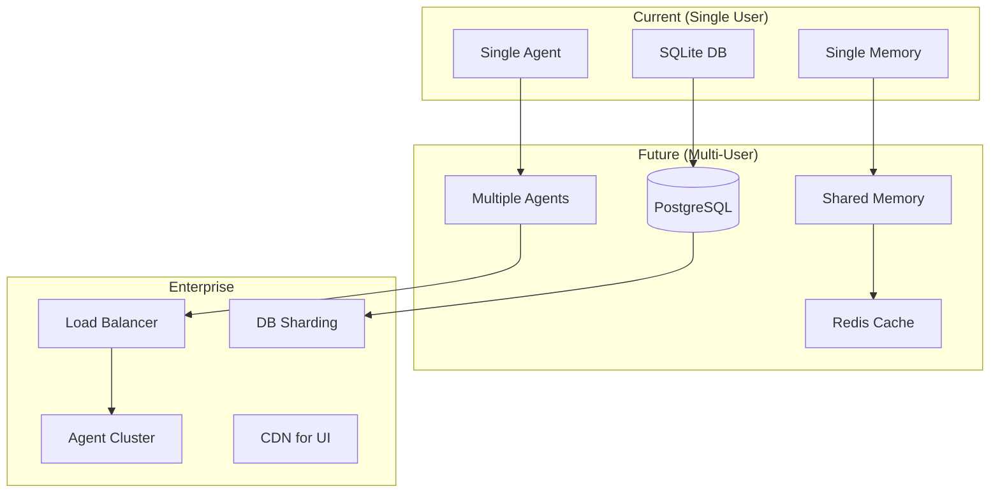

---

*Last Updated: January 2025*
*Version: 1.0.0*