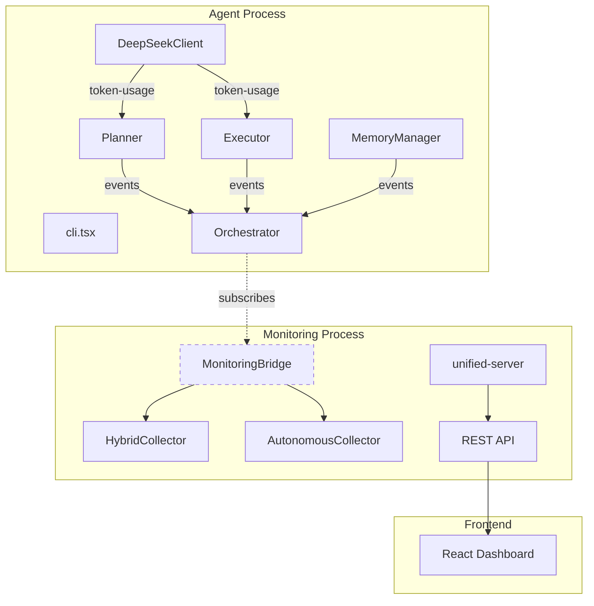

# FlexiCLI Monitoring Integration Architecture

## Date: 2025-09-16 (Updated - Production Integration Complete)

## Overview
FlexiCLI monitoring system is designed to be **loosely coupled** and **resilient**. The agent can work independently without monitoring, and monitoring can continue autonomously even if the agent crashes.

## Core Principles

1. **Agent Independence**: Agent must NEVER crash due to monitoring failures
2. **Graceful Degradation**: If monitoring is unavailable, agent continues without it
3. **Autonomous Operation**: Monitoring can run independently and survive agent crashes
4. **Event-Driven**: Monitoring attaches to existing agent events without modifying agent behavior

## Architecture Components

### 1. Agent Layer (Primary)
- **Location**: `/src/cli.tsx`, `/src/core/*`, `/src/memory/*`
- **Responsibility**: Core agent functionality
- **Events Emitted**:
  - `planning-start` / `planning-complete` (from Planner)
  - `tool-execute` / `tool-result` (from Executor)
  - `token-usage` (from DeepSeekClient via Planner/Executor)
  - `memory-layer-update` / `memory-update` (from MemoryManager)

### 2. Monitoring Bridge (Integration Layer)
- **File**: `/src/monitoring/backend/monitoring-bridge.ts`
- **Purpose**: Attaches to agent events and forwards to monitoring
- **Key Features**:
  - Wraps ALL monitoring operations in try-catch
  - Never throws errors to agent
  - Can attach/detach at runtime
  - Uses HybridCollector for flexibility

### 3. Monitoring Backend (Standalone)
- **Files**: 
  - `/src/monitoring/backend/unified-server.ts` - Main server
  - `/src/monitoring/backend/hybrid-collector.ts` - Data collection
  - `/src/monitoring/backend/autonomous-collector.ts` - Autonomous polling
- **Purpose**: Runs independently, provides API for dashboard
- **Key Features**:
  - Can run without agent
  - Persists data to SQLite
  - Provides REST API endpoints

### 4. Monitoring Dashboard (Frontend)
- **Location**: `/src/monitoring/react-dashboard/*`
- **Purpose**: Visualizes monitoring data
- **Connects to**: Monitoring backend API (port 4000)

## File Structure & Responsibilities

```
src/
├── cli.tsx                           # Agent entry, monitoring attachment
├── core/
│   ├── orchestrator.ts              # Coordinates, forwards events
│   ├── planner.ts                   # Emits planning events
│   └── executor.ts                  # Emits tool events
├── memory/
│   └── memory-manager.ts            # Emits memory events
└── monitoring/
    ├── backend/
    │   ├── monitoring-bridge.ts     # Attaches to agent (INTEGRATION)
    │   ├── hybrid-collector.ts      # Flexible data collection
    │   ├── MetricsCollector.ts     # Simple metrics storage
    │   ├── autonomous-collector.ts  # Polls database independently
    │   └── unified-server.ts        # REST API server
    └── react-dashboard/              # Frontend UI

```

## Event Flow



## Integration Points

### 1. Agent Startup (`cli.tsx`)
```typescript
// Check if monitoring is enabled
if (process.env.ENABLE_MONITORING === 'true') {
  try {
    // Check if monitoring server is running
    const response = await axios.get('http://localhost:4000/api/health');
    if (response.data.status === 'healthy') {
      // Create and attach monitoring bridge
      monitoringBridge = new MonitoringBridge(prisma, process.cwd());
      await monitoringBridge.start();
      monitoringBridge.attachToOrchestrator(orchestrator);
      monitoringBridge.attachToMemoryManager(memoryManager);
    }
  } catch (error) {
    // Continue without monitoring
    console.log('📊 Monitoring not available, continuing without it');
  }
}
```

### 2. Event Emission (Components)
Components emit events normally, unaware of monitoring:
```typescript
// In Planner
this.emit('planning-start', { timestamp: new Date() });

// In Executor  
this.emit('tool-execute', { name, args });

// In MemoryManager
this.emit('memory-layer-update', { layer, tokens });
```

### 3. Event Subscription (MonitoringBridge)
Bridge subscribes to events without modifying agent:
```typescript
orchestrator.on('tool-execute', (data) => {
  try {
    this.collector.startToolExecution(data);
  } catch (error) {
    // Log but don't throw
    console.error('Monitoring error:', error);
  }
});
```

## Required Methods

### HybridCollector Must Implement:
- `initialize()` - Set up collectors
- `startPipelineStage(stage)` - Track pipeline start
- `completePipelineStage(id, output, error)` - Track pipeline end
- `startToolExecution(tool)` - Track tool start
- `completeToolExecution(id, output, error)` - Track tool end
- `recordTokenUsage(metrics)` - Track token usage
- `updateMemoryLayer(layer)` - Track memory updates
- `getAllMetrics()` - Get all collected metrics
- `writeExecutionLogToDB(execution)` - Persist to database
- `updateSessionTokens(tokens)` - Update session token count

### MetricsCollector Should Provide:
Basic storage and retrieval of metrics without complex logic.

### AutonomousCollector Should:
Poll database and system independently of agent.

## Failure Scenarios & Handling

### 1. Monitoring Server Down
- **Detection**: Health check fails at startup
- **Handling**: Agent runs without monitoring
- **User Feedback**: "Monitoring not available, continuing without it"

### 2. Monitoring Bridge Initialization Fails
- **Detection**: Bridge constructor or start() throws
- **Handling**: Catch error, set monitoringBridge to null
- **User Feedback**: "Failed to initialize monitoring bridge"

### 3. Event Processing Error
- **Detection**: Collector method throws
- **Handling**: Log error, continue processing
- **User Feedback**: Silent (only in logs)

### 4. Database Write Fails
- **Detection**: Prisma operation throws
- **Handling**: Log error, continue in-memory
- **User Feedback**: Silent (only in logs)

## Testing Checklist

- [ ] Agent runs without monitoring server
- [ ] Agent survives monitoring server crash
- [ ] Agent survives monitoring bridge errors
- [ ] Monitoring continues after agent crash
- [ ] Events are properly forwarded when monitoring is active
- [ ] All monitoring tabs show real data
- [ ] Database persists across restarts

## Scripts

### Development (Hot Reload)
```bash
./monitoring-dev.sh start  # Start with hot reload
./agent.sh --prompt "test"  # Run agent
```

### Production
```bash
./monitoring.sh start       # Start monitoring
./agent.sh                  # Run agent
```

### Testing
```bash
# Test agent without monitoring
./agent.sh --prompt "test" --non-interactive

# Test agent with monitoring
ENABLE_MONITORING=true ./agent.sh --prompt "test" --non-interactive

# Test monitoring APIs
curl http://localhost:4000/api/tools
curl http://localhost:4000/api/pipeline
curl http://localhost:4000/api/memory
```

## Key Files to Review

1. **cli.tsx** - Monitoring attachment logic (lines 50-95)
2. **monitoring-bridge.ts** - Event subscription and forwarding
3. **hybrid-collector.ts** - Method implementations
4. **MetricsCollector.ts** - Basic metrics storage
5. **unified-server.ts** - API endpoints

## Common Issues & Solutions

### Issue: "this.collector.startPipelineStage is not a function"
**Cause**: MonitoringBridge using wrong collector class
**Solution**: Use HybridCollector instead of MetricsCollector

### Issue: "Cannot find module './metrics-collector.js'"
**Cause**: Import path mismatch (case sensitivity)
**Solution**: Use './MetricsCollector.js' (capital M)

### Issue: Agent crashes when monitoring is down
**Cause**: Missing error handling in monitoring attachment
**Solution**: Wrap all monitoring operations in try-catch

### Issue: No data in monitoring dashboard
**Cause**: Events not being forwarded from components
**Solution**: Ensure components emit events and bridge subscribes to them

## Maintenance Notes

1. **Adding New Events**: 
   - Emit from component
   - Subscribe in monitoring-bridge
   - Handle in hybrid-collector
   - Expose via API endpoint

2. **Removing Duplicate Code**:
   - Keep ONE collector implementation
   - Remove duplicate methods
   - Use consistent naming

3. **Testing Integration**:
   - Always test with monitoring ON and OFF
   - Verify graceful degradation
   - Check all error scenarios

## Cleanup Notes

### Removed Directories
- **`src/agent/`** - Empty directory, not referenced anywhere, removed on 2025-09-12
  - Likely created during early project setup but never used
  - The agent functionality is in `src/core/` and entry point is `src/cli.tsx`

### Files That Should Exist
- `src/monitoring/backend/MetricsCollector.ts` - Basic metrics storage
- `src/monitoring/backend/hybrid-collector.ts` - Main collector with all methods
- `src/monitoring/backend/autonomous-collector.ts` - Independent polling
- `src/monitoring/backend/monitoring-bridge.ts` - Integration layer
- `src/monitoring/backend/unified-server.ts` - REST API server

### Files to Avoid Creating
- Don't create duplicate collector implementations
- Don't create separate "agent" directory - use src/core
- Don't create monitoring files in root src/

---

*Last Updated: 2025-09-12*
*Author: Mike Admon & Claude*
*Version: 2.0 - Aligned and Documented*