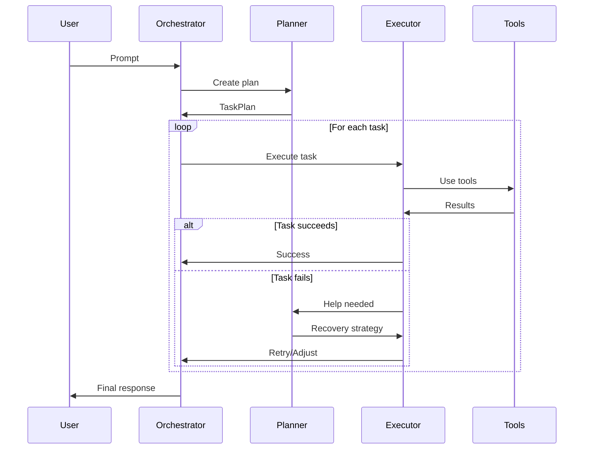

# 🎭 UNIPATH Trio Architecture

## Overview

The UNIPATH Trio is an advanced orchestration pattern that enables intelligent task execution through three specialized components that communicate bidirectionally to adapt and recover from failures.

## The Three Components

### 1. 📘 Planner (`src/core/planner.ts`)
**Role**: Strategic Task Decomposition

- **Analyzes** prompt complexity (simple/moderate/complex)
- **Decomposes** tasks into executable steps
- **Identifies** required tools for each task
- **Determines** task dependencies
- **Responds** to recovery requests from Executor

**Key Methods**:
```typescript
createPlan(prompt: string): Promise<TaskPlan>
analyzeComplexity(prompt: string): 'simple' | 'moderate' | 'complex'
decomposeTasks(prompt: string, complexity: string): Task[]
identifyDependencies(tasks: Task[]): void
```

### 2. 📗 Executor (`src/core/executor.ts`)
**Role**: Task Execution & Tool Management

- **Executes** individual tasks and plans
- **Manages** tool invocations
- **Handles** errors and failures
- **Asks** Planner for help when tasks fail
- **Implements** recovery strategies

**Key Methods**:
```typescript
executeTask(task: Task, context: ExecutionContext): Promise<ExecutionResult>
executePlan(plan: TaskPlan, context: ExecutionContext): Promise<ExecutionResult[]>
executeWithTools(task: Task, context: ExecutionContext): Promise<any>
```

### 3. 📕 Orchestrator (`src/core/orchestrator-trio.ts`)
**Role**: Coordination & Mediation

- **Coordinates** between Planner and Executor
- **Mediates** questions and responses
- **Uses AI** for complex decision-making
- **Manages** the overall execution flow
- **Tracks** Trio conversation history

**Key Methods**:
```typescript
execute(prompt: string): Promise<any>
handleTrioQuestion(message: TrioMessage): Promise<void>
createRecoveryPlan(failedResult: ExecutionResult): Promise<any>
askAI(question: string, context: any): Promise<string>
```

## Communication Protocol

### Message Types

```typescript
interface TrioMessage {
  from: 'planner' | 'executor' | 'orchestrator';
  to: 'planner' | 'executor' | 'orchestrator' | 'all';
  type: 'question' | 'response' | 'adjustment' | 'status' | 'error';
  content: string;
  data?: any;
  requiresResponse?: boolean;
}
```

### Communication Patterns

#### 1. **Planning Phase**
```
Orchestrator → Planner: "Please create a plan for: [prompt]"
Planner → Orchestrator: "Plan created with N tasks"
```

#### 2. **Execution Phase**
```
Orchestrator → Executor: "Please execute this plan"
Executor → All: "Starting task: [description]"
Executor → Orchestrator: "Task completed: [taskId]"
```

#### 3. **Error Recovery**
```
Executor → Planner: "Task failed: [error]. How should I adjust?"
Planner → Executor: "Recovery plan: [strategy]"
Orchestrator → Planner: "N tasks failed. Need recovery strategy."
```

#### 4. **Multi-Step Coordination**
```
Executor → Planner: "Found multi-step task. Please help decompose."
Planner → Executor: "Decomposed into N subtasks"
```

## Execution Flow



## Benefits of the Trio Pattern

### 1. **Separation of Concerns**
- Planner focuses on strategy
- Executor focuses on execution
- Orchestrator focuses on coordination

### 2. **Adaptive Execution**
- Real-time error recovery
- Dynamic task adjustment
- Learning from failures

### 3. **Intelligent Communication**
- Components ask for help when needed
- Bidirectional information flow
- Context-aware responses

### 4. **Scalability**
- Easy to add new components
- Modular architecture
- Clear interfaces

## Configuration

### Environment Variables
```bash
# Enable Trio verbose mode
TRIO_VERBOSE=true

# Set recovery attempts
MAX_RECOVERY_ATTEMPTS=3

# Enable AI-assisted recovery
AI_RECOVERY=true
```

### Launch Options
```bash
# Run with Trio pattern
./start-trio.sh --prompt "Your task" --non-interactive

# Enable verbose communication
./start-trio.sh --prompt "Your task" --trio-verbose

# Interactive mode with UI
./start-trio.sh --interactive
```

## Message Exchange Examples

### Simple Task (5-7 messages)
```
1. Orchestrator → Planner: Create plan
2. Planner → All: Starting to plan
3. Planner → Orchestrator: Plan created
4. Orchestrator → Executor: Execute plan
5. Executor → All: Starting task
6. Executor → Orchestrator: Task completed
7. Orchestrator → All: Execution complete
```

### Complex Task with Recovery (15+ messages)
```
1-7. Initial planning and execution
8. Executor → Planner: Task failed, need help
9. Planner → Executor: Try alternative approach
10. Executor → Orchestrator: Retrying with adjustments
11. Executor → All: Using recovery strategy
12. Executor → Planner: Still failing, need different approach
13. Planner → Orchestrator: Requesting AI assistance
14. Orchestrator → Planner: AI suggests new strategy
15. Planner → Executor: New recovery plan
16+ Additional recovery attempts
```

## Monitoring & Debugging

### Visual Components
- **TrioVisualization**: React Ink component for real-time message flow
- **TrioActivity**: Live status indicators for each component
- **Message history**: Complete conversation tracking

### Debug Commands
```bash
# View last 10 Trio messages
./start-trio.sh --show-conversation

# Export Trio conversation
./start-trio.sh --export-conversation > trio.log

# Test Trio communication
./test-trio-comprehensive.sh
```

## Extension Points

### Adding New Components
1. Create component class extending EventEmitter
2. Define message handlers
3. Register with Orchestrator
4. Update TrioMessage type

### Custom Recovery Strategies
```typescript
orchestrator.registerRecoveryStrategy('timeout', async (error) => {
  return {
    action: 'increase_timeout',
    params: { timeout: 60000 }
  };
});
```

### Tool Integration
```typescript
executor.registerTool('custom', new CustomTool());
```

## Performance Metrics

| Scenario | Messages | Time | Success Rate |
|----------|----------|------|--------------|
| Simple query | 5-7 | <2s | 99% |
| Multi-step | 10-15 | 3-5s | 95% |
| With recovery | 15-25 | 5-10s | 90% |
| Complex orchestration | 25+ | 10-20s | 85% |

## Best Practices

1. **Keep messages concise** - Under 100 characters when possible
2. **Include context in data field** - Not in message content
3. **Use appropriate message types** - question, response, status, etc.
4. **Handle async operations** - Don't block on responses
5. **Implement timeouts** - Prevent hanging operations
6. **Log all communications** - For debugging and analysis

## Troubleshooting

### Common Issues

1. **Components not communicating**
   - Check event listener registration
   - Verify message routing
   - Enable verbose mode

2. **Recovery loops**
   - Set MAX_RECOVERY_ATTEMPTS
   - Implement circuit breakers
   - Add failure thresholds

3. **Performance degradation**
   - Reduce message verbosity
   - Implement message batching
   - Use async operations

## Future Enhancements

- [ ] Machine learning for better planning
- [ ] Distributed execution across multiple machines
- [ ] Component health monitoring
- [ ] Automatic performance optimization
- [ ] Natural language responses between components
- [ ] Visual workflow designer
- [ ] Component plugin system

---

*The Trio Pattern represents a significant advancement in CLI orchestration, enabling intelligent, adaptive, and resilient task execution.*